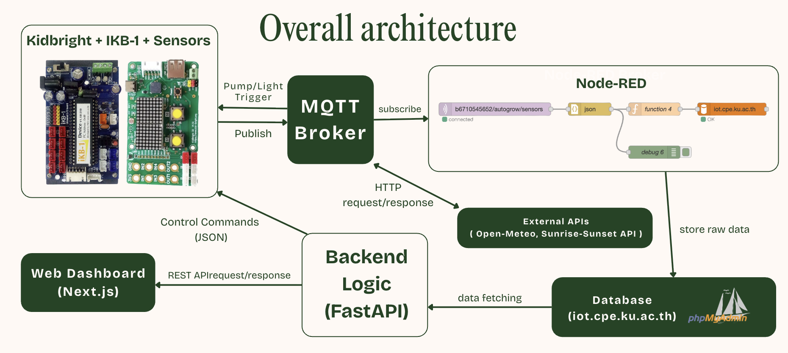

# AutoGrow

AutoGrow is an IoT-enabled plant lifecycle management platform for controlled growing environments (for example, glasshouse and indoor farming). It combines live sensor telemetry, stage-aware automation logic, outdoor weather context, and a web dashboard for monitoring and decision support.

This repository includes:
- A FastAPI backend for lifecycle logic, telemetry APIs, and integrations.
- A Next.js dashboard for monitoring, visualization, and grow-session actions.
- CSV-based target datasets and helper scripts for bootstrapping plant profiles.

## Project Objective

Aligned with the project presentation (`Auto.pdf`), AutoGrow has two primary objectives:

1. Autonomous resource optimization.
Automate water and light actions using live telemetry plus growth-stage context to reduce manual intervention.

2. Data-driven actionable insights.
Transform raw sensor streams into practical outputs such as Health Score and Harvest ETA so users can make decisions quickly.

## Project Purpose

- Monitor plant environment continuously (soil, temperature, humidity, light, vibration).
- Track each plant through its lifecycle from seed to harvest.
- Compare indoor conditions with outdoor weather trends.
- Provide an open JSON API for dashboarding and data-sharing use cases.
- Serve as a practical integration of IoT + backend logic + analytics UI.

## System Architecture



## Tech Stack

| Layer | Technology | Purpose |
|---|---|---|
| Frontend | Next.js 16, React 19, TypeScript | Dashboard UI |
| Frontend data | SWR | Polling and client caching |
| Charts | Recharts | Time-series, scatter, and comparison charts |
| Backend API | FastAPI, Uvicorn | REST API and app runtime |
| Backend models | Pydantic v2, SQLModel, SQLAlchemy | Schema and DB access |
| Primary app DB | SQLite | Plant/session state, observations, cache |
| Telemetry history DB | MySQL (Autogrow table) | `/history` source |
| Optional TSDB | InfluxDB 3 client | Optional metric streaming |
| Messaging | MQTT (paho-mqtt) | Sensor ingestion + device commands |
| External context | Open-Meteo, OpenWeatherMap, Sunrise-Sunset API | Outdoor weather/solar context |

## Repository Structure

```text
AutoGrow/
  backend/                # FastAPI service layer
    routers/              # REST endpoints
    services/             # Business logic (stage, weather, health, actuators)
    db/                   # SQLite + optional Influx helpers
    mqtt/                 # MQTT subscriber/publisher
    scripts/              # Import and utility scripts
    main.py               # API entrypoint
  frontend/               # Next.js dashboard
    app/                  # App router pages/layout
    components/           # UI cards and charts
    lib/                  # API client helpers
    public/assets/        # Icons and diagrams
  data/                   # CSV datasets
  docs/                   # Documentation assets
  README.md               # Project documentation
```

<details>
<summary>Detailed structure (developer view)</summary>

```text
AutoGrow/
  backend/
    main.py
    models.py
    seed_data.py
    requirements.txt
    db/
      sqlite.py
      influx.py
    mqtt/
      subscriber.py
      publisher.py
    routers/
      plants.py
      stage.py
      history.py
      health.py
      light.py
      pump.py
      context.py
      targets.py
      observations.py
      harvest.py
    services/
      stage_engine.py
      external_weather.py
      health_score.py
      actuators.py
      repo.py
    scripts/
      import_targets_csv.py
  frontend/
    app/
      page.tsx
      layout.tsx
      globals.css
    components/
      GrowthStatus.tsx
      LightStatus.tsx
      IrrigationMonitor.tsx
      GlasshouseCard.tsx
      OutdoorDataCard.tsx
      SensorChart.tsx
      SoilHumidityScatter.tsx
      TemperatureComparisonScatter.tsx
      DailyTempHumidityComparisonBarChart.tsx
      SoilMoisturePumpChart.tsx
      DataSharingApiCard.tsx
    lib/
      api.ts
    public/assets/
      icons/
      logos/
      diagrams/
  data/
    plant_targets.csv
  docs/
    architecture.png
  README.md
```

</details>

## Core Features

- Plant lifecycle management.
  - Start plant sessions, track active session, harvest active session.
  - Stage progression with scheduled transitions and confirmation flow.

- Real-time telemetry ingestion.
  - MQTT topics for soil, temperature, humidity, light, vibration.
  - Combined sensor payload support (`+/autogrow/sensors`).

- Insight endpoints.
  - Health score aggregation (`/health`).
  - Harvest ETA (`/harvest-eta`).
  - Pump/light status views.

- Weather and outdoor comparisons.
  - Current weather context (`/context/weather`).
  - Outdoor hourly history (`/outdoor/history`).
  - Outdoor daily averages (`/outdoor/daily-avg`).

- Visualization dashboard.
  - Multi-panel cards for growth status, irrigation, climate, light, weather.
  - Correlation charts for indoor vs outdoor metrics.
  - Daily comparison and event-over-time charts.

## Data Sources

1. Primary sensor source (via MQTT / KidBright32).
- `autogrow/soil`
- `autogrow/temp`
- `autogrow/humidity`
- `autogrow/light`
- `autogrow/vibration`
- `+/autogrow/sensors` (combined payload)

2. External APIs.
- Open-Meteo (primary weather and outdoor history).
- OpenWeatherMap (fallback current weather, if API key configured).
- Sunrise-Sunset API (sunrise/sunset supplementation fallback).

3. Local target dataset.
- `data/plant_targets.csv` for plant-specific target ranges and stage durations.

## API Overview

Interactive docs are available at:
- `http://localhost:8000/docs`
- `http://localhost:8000/redoc`

### Lifecycle and plant management

| Method | Endpoint | Description |
|---|---|---|
| GET | `/plants` | List plant instances |
| GET | `/plants/active` | Get active plant instance |
| POST | `/plants` | Create plant instance |
| PATCH | `/plants/{plant_id}` | Update plant instance |
| DELETE | `/plants/{plant_id}` | Delete plant instance |
| POST | `/plants/start` | Start active plant by plant type name |
| POST | `/plants/harvest-active` | Harvest and clear active session |
| GET | `/plants/{plant_id}/light` | Stage-derived light color/status |
| POST | `/plants/{plant_id}/confirm-transition` | Confirm stage transition |

### Plant types and targets

| Method | Endpoint | Description |
|---|---|---|
| GET | `/plants/types` | List plant types |
| POST | `/plants/types` | Create plant type |
| PATCH | `/plants/types/{type_id}` | Update plant type |
| DELETE | `/plants/types/{type_id}` | Delete plant type |
| GET | `/plant-types` | Alias list endpoint for frontend |
| POST | `/plant-types` | Alias create endpoint for frontend |
| GET | `/targets/plant-types/{plant_type_id}/targets` | Get target range |
| PUT | `/targets/plant-types/{plant_type_id}/targets` | Upsert target range |

### Stage, telemetry, and insights

| Method | Endpoint | Description |
|---|---|---|
| GET | `/stage` | Current stage summary |
| POST | `/stage/set` | Manually set stage |
| POST | `/stage/reset` | Reset stage and schedule transitions |
| GET | `/history` | Sensor timeline (MySQL `Autogrow` source) |
| GET | `/light` | Current light telemetry |
| GET | `/pump-status` | Pump and vibration status |
| GET | `/health` | Aggregated health score |
| GET | `/harvest-eta` | Remaining days and projected date |
| POST | `/observations` | Add manual observation |
| GET | `/observations` | List recent observations |

### Weather and outdoor context

| Method | Endpoint | Description |
|---|---|---|
| GET | `/context/weather` | Current weather + sunrise/sunset |
| GET | `/outdoor/history` | Outdoor hourly history |
| GET | `/outdoor/daily-avg` | Outdoor daily averages |

## Data Model Summary

### SQLite tables (app state)

- `PlantType`: name, stage durations, stage colors.
- `PlantTypeTarget`: temp/humidity/light target ranges per type.
- `PlantInstance`: active session, stage index, started/harvested timestamps.
- `SensorReading`: ingested telemetry linked to active plant instance.
- `GrowthStage`: current stage state snapshots.
- `Observation`: manual observation entries.
- `WeatherCache`: cached external API payloads.

### MySQL table (history source)

- `Autogrow` table (read by `/history`) for historical timeline data used in charts.

## Configuration

Create `backend/.env` for backend runtime values.

### Backend environment variables

| Variable | Required | Default | Purpose |
|---|---|---|---|
| `SQLITE_PATH` | No | `backend/autogrow.db` | SQLite database location |
| `DEFAULT_LAT` | No | `0` | Fallback weather latitude |
| `DEFAULT_LON` | No | `0` | Fallback weather longitude |
| `WEATHER_CACHE_TTL` | No | `900` | Weather cache TTL in seconds (15 min) |
| `OWM_API_KEY` | No | empty | OpenWeather fallback API key |
| `MQTT_BROKER` | No | empty | MQTT host |
| `MQTT_PORT` | No | empty | MQTT port |
| `MQTT_USER` | No | empty | MQTT username |
| `MQTT_PASS` | No | empty | MQTT password |
| `INFLUX_URL` | No | empty | InfluxDB host |
| `INFLUX_TOKEN` | No | empty | Influx token |
| `INFLUX_BUCKET` | No | empty | Influx database/bucket |
| `MYSQL_URL` | No | internal default in code | Alternative MySQL DSN helper |

Note: `/history` currently creates its own MySQL engine in `backend/routers/history.py` with explicit connection parameters.

### Frontend environment variables

| Variable | Required | Default | Purpose |
|---|---|---|---|
| `NEXT_PUBLIC_API_URL` | No | `http://localhost:8000` | Backend base URL |
| `NEXT_PUBLIC_DEFAULT_LAT` | No | `13.7563` | Default dashboard latitude |
| `NEXT_PUBLIC_DEFAULT_LON` | No | `100.5018` | Default dashboard longitude |

### Example backend `.env`

```env
SQLITE_PATH=./autogrow.db
DEFAULT_LAT=13.7563
DEFAULT_LON=100.5018
WEATHER_CACHE_TTL=900

MQTT_BROKER=broker.example.com
MQTT_PORT=1883
MQTT_USER=your_user
MQTT_PASS=your_pass

INFLUX_URL=
INFLUX_TOKEN=
INFLUX_BUCKET=

OWM_API_KEY=
```

## How to Run

## Prerequisites

- Python 3.11+ (3.12 recommended)
- Node.js 20+
- npm

Optional for full integration:
- MQTT broker access
- MySQL access for the `Autogrow` table
- OpenWeather API key (optional fallback)

## 1) Run backend

```bash
cd backend
python3 -m venv .venv
source .venv/bin/activate
pip install -r requirements.txt
uvicorn main:app --reload --host 0.0.0.0 --port 8000
```

Backend docs:
- `http://localhost:8000/docs`

## 2) Run frontend (real backend)

```bash
cd frontend
npm install
NEXT_PUBLIC_API_URL=http://localhost:8000 npm run dev
```

Frontend app:
- `http://localhost:3000`

## 3) Run tests

### Backend tests (pytest)

```bash
cd backend
source .venv/bin/activate
pip install -r requirements.txt
python -m pytest
```

Run one backend test file:

```bash
cd backend
source .venv/bin/activate
python -m pytest tests/test_plants_router.py
```

Run one backend test function:

```bash
cd backend
source .venv/bin/activate
python -m pytest tests/test_plants_router.py::test_start_and_harvest_active_plant
```

### Frontend tests (Vitest + Testing Library)

```bash
cd frontend
npm install
npm run test
```

Run one frontend test file:

```bash
cd frontend
npm run test -- tests/components/LightStatus.test.tsx
```

Run frontend coverage:

```bash
cd frontend
npm run test:coverage
```

## Seed and Import Utilities

## Seed demo data

```bash
cd backend
source .venv/bin/activate
python seed_data.py
```

## Import target ranges from CSV

```bash
cd /path/to/repo
source backend/.venv/bin/activate
PYTHONPATH=. python3 backend/scripts/import_targets_csv.py data/plant_targets.csv
```

## Runtime Cadence and Refresh

- Frontend weather polling: every 15 minutes.
- Backend weather cache TTL default: 15 minutes (`WEATHER_CACHE_TTL=900`).
- Many dashboard cards poll every 30-60 seconds.
- Outdoor comparison charts poll every 5 minutes.
- Pending stage refresher loop runs every 10 minutes.

## Typical Development Workflow

1. Start backend and frontend.
2. Import or create plant types/targets.
3. Start a plant session from the dashboard (`/plants/start`).
4. Publish sensor payloads over MQTT.
5. Observe stage, health, ETA, and comparison charts.
6. Harvest active plant when complete (`/plants/harvest-active`).

## Troubleshooting

- Dashboard shows unavailable for history charts.
  - Check MySQL connectivity and the `Autogrow` table used by `/history`.

- Weather endpoint returns 502.
  - Provide `lat/lon` query values or set `DEFAULT_LAT/DEFAULT_LON`.
  - Verify outbound connectivity to weather providers.

- No active plant banners in many cards.
  - Start a session via `/plants/start` or dashboard Start action.

- MQTT not working.
  - Verify `MQTT_BROKER` and `MQTT_PORT` are set and reachable.
  - Check topic names and payload format.

- Influx writes not present.
  - Ensure `INFLUX_URL`, `INFLUX_TOKEN`, and `INFLUX_BUCKET` are set.

## Security and Production Notes

- API currently allows all CORS origins (`allow_origins=["*"]`).
- API endpoints are unauthenticated by default.
- Sensitive credentials should be moved fully to environment variables and secret management before production.
- Review and secure database/MQTT credentials before public deployment.

## Roadmap Suggestions

- Add authentication/authorization for data-sharing APIs.
- Centralize all DB credentials to env (remove hardcoded DSN segments).
- Add test coverage for routers, stage scheduling, and weather fallback logic.
- Add containerized deployment (`docker-compose`) for reproducible local setup.
- Add CI lint/test pipeline for backend and frontend.
